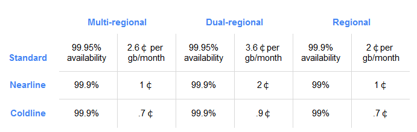

# ストレージクラス

## 地理的冗長性

* Region
    + 単一リージョン
    + VMインスタンスと同じリージョンにすると低レイテンシとなる。
* Multi-region
    + 複数のリージョンで地理的に冗長化
    + `us` , `eu` , `asia` から選べる
    + VMインスタンスと同じリージョンにして低レイテンシとすることができない。
* Dual-region
    + ある特定の2リージョンに冗長化
        + `nam4` アイオワとサウスカロライナ
        + `eur4` オランダとフィンランド
    + 上記に要件が当てはまらない場合はまず使わない
    + VMインスタンスと同じ（もしくは近い）リージョンにすると低レイテンシとなる。
    + コストは一番高い

## アクセス頻度

* Standard
* Nearline
* Coldline

昔はDRAっていうのもあった。今は非推奨。

# データ取得

* S3 Glacierはテープバックアップを使用しているらしい。  
  なので、データ取り出しに時間がかかる。

* GCSのNearline, Coldlineはテープを使用していない。  
  低価格のストレージ機器を使っており、データ取り出しは数秒でOK。

# イレブン9

* イレブン9とは「耐久性」であり、可用性は99.99%（1年間で50分強はデータにアクセスできない状態がある）
* 10,000個のオブジェクトのうち1オブジェクトを失うのに1,000万年かかる。

# オブジェクトストレージとは

## 参考
* [ストレージ オブジェクトストレージとは - 富士通](https://www.fujitsu.com/jp/products/computing/storage/lib-f/tech/beginner/object-storage/)
* [5分で絶対に分かるオブジェクトストレージ (3/5) - IT](https://www.atmarkit.co.jp/ait/articles/1705/29/news014_3.html)

## vs ファイルストレージ
* 保存期間, コピー回数など多くのメタデータを保持できる
* ディレクトリのような階層構造はない（S3やGCSでスラッシュ区切りになっているのは、オブジェクトパス名に `/` が入っているというだけ）
* 一般的には汎用ストレージを並列構築しており、スケーラビリティに優れている。
    + フラットな構造でデータを保存するので、データを分散して保持しやすい。
    + ファイルストレージでは、階層構造を持っているのでここの階層はこっちのストレージサーバ、など
      細かく構築してあげないといけない。
* 更新が少ない大容量データに向いている。
    + S3では1ファイルサイズの上限は5TB（1PUT上限は5GBなのでMultipartUploadで分割アップロードする必要はあり）
    + GCSも5TB。1PUTの上限も5TB。
* データ操作にREST APIが必要

## vs ブロックストレージ
* ブロックストーレジは、1ファイルを複数ブロックに分けて保持。
    + 低レイテンシも実現できる。
    + 一般的に高価。
    + そもそもファイルストレージとはレイヤーが違う。
      ブロックストレージをファイルストレージとして利用する、など。
* EBSはブロックストレージ
* ブロックストレージは部分更新が可能。
    + オブジェクトストレージはオブジェクト単位でatomic。つまり部分的な更新だとしてもオブジェクトをまるごと更新する。

# S3との比較

## リージョン

リージョンはS3と同様に選択可能。
Multi-regionというのもあり、特定のざっくりした地域（`us` , `eu` , `asia`）に勝手に冗長化してくれる。

## アベイラビリティゾーン

特に選択できない。S3の標準も勝手にマルチAZになるはず。
S3には `1ゾーン` っていうシングルAZで低コスト、というオプションも選べる。これはGCSには見当たらなかった。

## ファイル構造

S3と同じくバケット > オブジェクト、という構造。
一般的なオブジェクトストレージと同義。

## ストレージクラス

S3ほど細かくはなっていないが、オブジェクトごとに設定可能。
GCSではgsutilコマンドを使う必要あり。S3はブラウザで色々設定変更できて楽だなと思う。

## アクセスコントロール

## 暗号化

GCSでも可能。以下の選択が可能。
* GCP側で全部やってくれる
* GCP KMSでクラウド上にそれぞれの鍵で管理
* オンプレ上のそれぞれの鍵で管理

S3のようにオブジェクトごとに暗号化オプションを選択するには [gsutilコマンドを使う](https://cloud.google.com/storage/docs/encryption/using-customer-managed-keys?hl=ja#add-object-key) 。

## WEBホスティング

S3と同様、権限をpublicにすることで静的ファイルをホスティングすることが可能。

* 独自ドメインも設定可能（CNAMEでGCSの発行したドメインに紐付ける）
* デフォルトでHTTPS
* デフォルトページ（ディレクトリアクセスしたときのindex.html的な）やエラーページも指定できる。
* AWS Cloud Frontのキャッシュを介したアクセスはちょっと特殊。  
  メタデータに `Cache-Control: public,max-age=3` などと書くとGoogleのエッジキャッシュというのが有効になるらしい。
    + [GCP エッジキャッシュ](https://qiita.com/sinmetal/items/37c105a098174fb6bf77)。
    + [Cloud Storage のベスト プラクティス](https://cloud.google.com/storage/docs/best-practices?hl=ja#traffic)

## ロギング

ロギングを有効にできる。Stack Driver（Cloud WatchのGCP版）に保存できたり。  
ただしgcloudコマンドで設定する必要あり。  
Cloud Audit Logging（監査ログ）ってのもある。

## セキュリティ対策

上述の「Cloud Audit Logging」ってのがある。（Cloud TrailのGCP版）
アラートも設定可能。

## API

上述の通り、GCPコンソール（ブラウザ）で設定できる項目が結構少ない。
gcloudコマンドを多用することになる。

